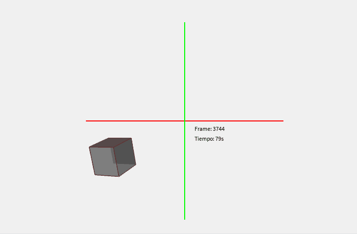

# 🧪 Transformaciones Básicas en Computación Visual

## 📅 Fecha
`2025-04-23` – Fecha de realización

---

## 🎯 Objetivo del Taller

En este taller se tiene como objetivo explorar los conceptos fundamentales de transformaciones geométricas (traslación, rotación y escala) en distintos entornos de programación, en este caso en el entorno de Processing.

---

## 🧠 Conceptos Aprendidos

Lista los principales conceptos aplicados:

- [x] Transformaciones geométricas (escala, rotación, traslación)

---

## 🔧 Herramientas y Entornos

Especifica los entornos usados:

- Processing (Java)


---

## 📁 Estructura del Proyecto

```
2025-04-23_taller0_transformaciones/
├── processing/
  ├──sketch_250422b.pde      # Java
  ├──DemostracionCuboProcessing.gif # Gif
  ├──README.md               
├── python/                 # python, colab
├── threejs/            # react, threejs
├── unity/              # C#, unity
```


---

## 🧪 Implementación

Explica el proceso:

### 🔹 Etapas realizadas
1. Preparación de escena y cración de cubo.
2. Aplicación de transformaciones.
3. Visualización.
4. Guardado de resultados.

### 🔹 Código relevante

Incluye un fragmento que resuma el corazón del taller:

```java
  // Aplicamos transformaciones al cubo
  pushMatrix(); // Aislamos las transformaciones
  
  // Traslación ondulada usando sin() y frameCount
  float waveX = sin(frameCount * 0.05) * 150;
  float waveY = cos(frameCount * 0.03) * 100;
  translate(waveX, waveY, 0);
```

---

## 📊 Resultados Visuales

### 📌 GIF animado**:



---

## 🧩 Prompts Usados

Enumera los prompts utilizados:

```text
"Como crear un cubo en processing"
"Como genero una animación sinosoidal del cubo"
```

---

## 💬 Reflexión Final

Responde en 2-3 párrafos:

- ¿Qué aprendiste o reforzaste con este taller? A hacer un programa sencillo en processing
- ¿Qué parte fue más compleja o interesante? Crear una de mis primeras animaciones
- ¿Qué mejorarías o qué aplicarías en futuros proyectos? Una figura más compleja

---

## 👥 Contribuciones 

Describe exactamente lo que hiciste tú:

```markdown
- Programé el cubo
- Generé los GIFs y documentación
- Integré el control generado por modelos de IA para la animación
```

---

## ✅ Checklist de Entrega

- [x] Carpeta `2025-04-23_taller0_transformaciones`
- [x] Código limpio y funcional
- [x] GIF incluido con nombre descriptivo (si el taller lo requiere)
- [x] Visualizaciones o métricas exportadas
- [x] README completo y claro
- [x] Commits descriptivos en inglés

---