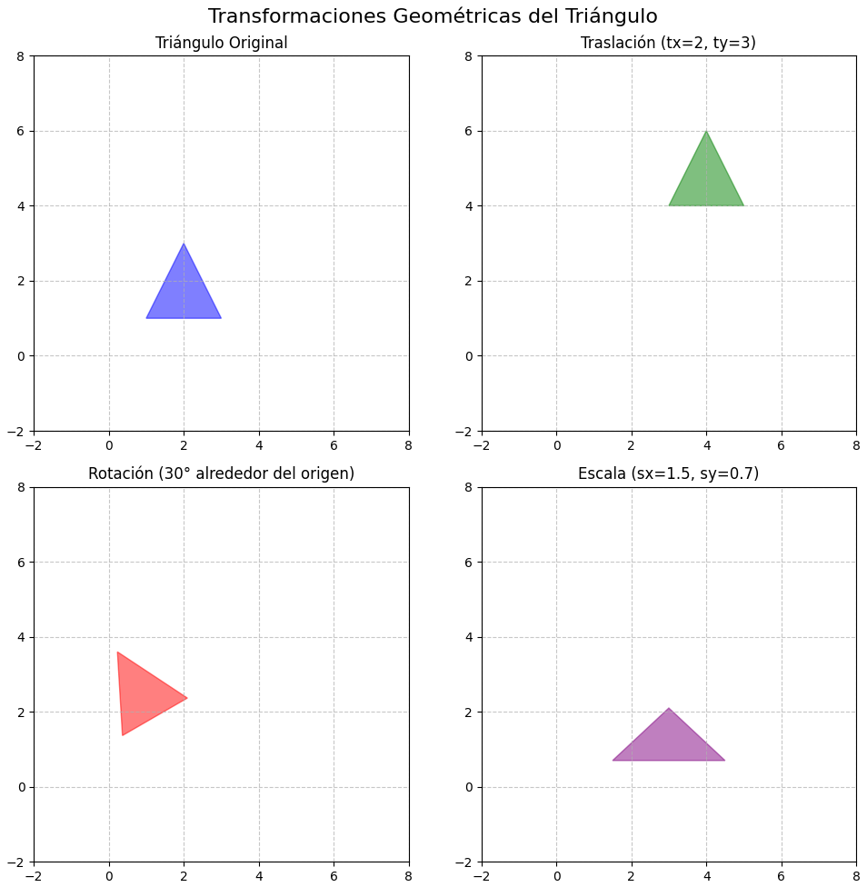
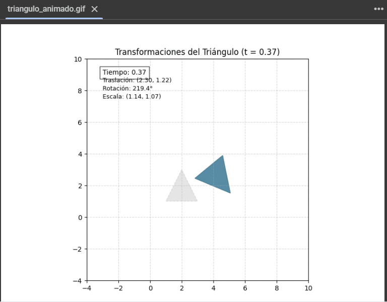

# 🧪 Transformaciones Básicas en Computación Visual

## 📅 Fecha
`2025-04-23` – Fecha de realización

---

## 🎯 Objetivo del Taller

En este taller se tiene como objetivo explorar los conceptos fundamentales de transformaciones geométricas (traslación, rotación y escala) en distintos entornos de programación, en este caso en el entorno de Python - Colab.

---

## 🧠 Conceptos Aprendidos

Lista los principales conceptos aplicados:

- [x] Transformaciones geométricas (escala, rotación, traslación)

---

## 🔧 Herramientas y Entornos

Especifica los entornos usados:

- Colab (Python)
link colab:
https://colab.research.google.com/drive/1sufd8x8ohhrXHqmaNsTaLYDQ9IrbYuPy?usp=sharing
---

## 📁 Estructura del Proyecto

```
2025-04-23_taller0_transformaciones/
├── processing/              
├── python/                 # python, 
  ├──Taller1ComputacionVisual.ipynb      # Colab
  ├──image.png
  ├──DemostracionTrianguloPython.gif # Gif
  ├──README.md      
├── threejs/            # react, threejs
├── unity/              # C#, unity
```


---

## 🧪 Implementación

Explica el proceso:

### 🔹 Etapas realizadas
1. Cración del triangulo.
2. Aplicación de transformaciones.
3. Generar animación.
4. Generar y exportar gif.

### 🔹 Código relevante

Incluye un fragmento que resuma el corazón del taller:

```python
# Generar frames con progresión no lineal
for frame in range(n_frames + 1):
    t = frame / n_frames
    frames.append(aplicar_transformacion(t))

    # Mostrar progreso
    if frame % 20 == 0:
        print(f"Generando frame {frame}/{n_frames}...")

# Guardar GIF con optimización
print("Guardando GIF...")
imageio.mimsave(gif_path, frames, duration=duration, fps=24, loop=0)

```

---

## 📊 Resultados Visuales


### 📌 GIF animado**:



---

## 🧩 Prompts Usados

Enumera los prompts utilizados:

```text
"Como crear un gif en python colab "
"Como aplicar transformaciones al triangulo"
```

---

## 💬 Reflexión Final

Responde en 2-3 párrafos:

- ¿Qué aprendiste o reforzaste con este taller? A hacer un gif en python
- ¿Qué parte fue más compleja o interesante? Crear una animación según las indicaciones
- ¿Qué mejorarías o qué aplicarías en futuros proyectos? Una figura más compleja

---

## 👥 Contribuciones 

Describe exactamente lo que hiciste tú:

```markdown
- Programé el triangulo
- Generé los GIFs y documentación
- Integré el control generado por modelos de IA para la animación
```

---

## ✅ Checklist de Entrega

- [x] Carpeta `2025-04-23_taller0_transformaciones`
- [x] Código limpio y funcional
- [x] GIF incluido con nombre descriptivo (si el taller lo requiere)
- [x] Visualizaciones o métricas exportadas
- [x] README completo y claro
- [x] Commits descriptivos en inglés

---