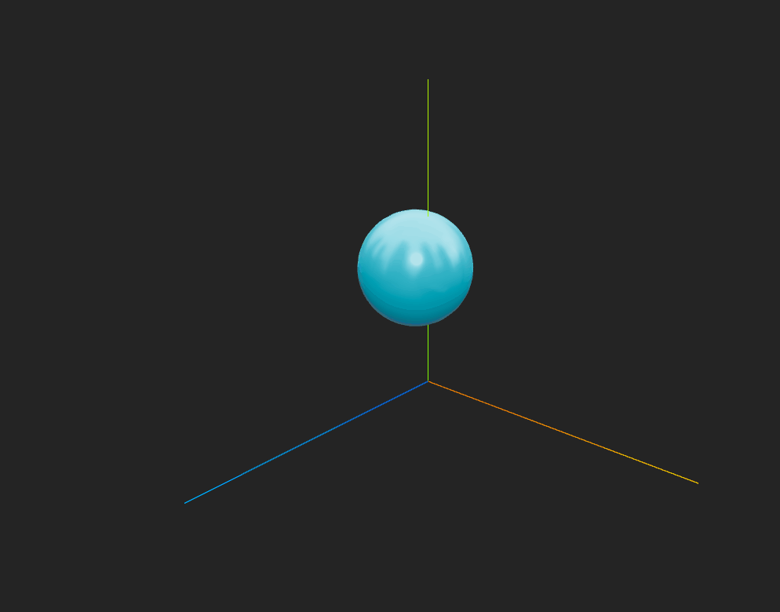

# 🧪 Transformaciones Básicas en Computación Visual

## 📅 Fecha
`2025-04-23` – Fecha de realización

---

## 🎯 Objetivo del Taller

En este taller se tiene como objetivo explorar los conceptos fundamentales de transformaciones geométricas (traslación, rotación y escala) en distintos entornos de programación, en este caso en el entorno de Threejs.

---

## 🧠 Conceptos Aprendidos

Lista los principales conceptos aplicados:

- [x] Transformaciones geométricas (escala, rotación, traslación)

---

## 🔧 Herramientas y Entornos

Especifica los entornos usados:

- Visual Studio Code (Three js fiber)


---

## 📁 Estructura del Proyecto

```
2025-04-23_taller0_transformaciones/
├── processing/           
├── python/                 # python, colab
├── threejs/            # react, threejs
  ├──node_modules     # NPM
  ├──Public
     ├──demostracionTrianguloThreejs.gif # Gif
  ├── src             # Código fuente
  ├──README.md    
├── unity/              # C#, unity
```


---

## 🧪 Implementación

Explica el proceso:

### 🔹 Etapas realizadas
1. Crear proyecto en threejs fiber.
2. Crear componente EsferaAnimada.jsx.
3. Generar código para animación en ap.jsx.
4. Visualizar en localhost y grabar gifs de resultados.

### 🔹 Código relevante

Incluye un fragmento que resuma el corazón del taller:

```js
export function EsferaAnimada() {
  const meshRef = useRef()
  const scaleFactor = useRef(1)
  
  useFrame(({ clock }) => {
    if (!meshRef.current) return
    
    const time = clock.elapsedTime
    
    // 1. Movimiento senoidal
    meshRef.current.position.x = Math.sin(time) * 3
    meshRef.current.position.y = Math.cos(time * 0.5) * 2
    
    // 2. Rotación
    meshRef.current.rotation.x += 0.01
    meshRef.current.rotation.y += 0.005
    
    // 3. Escalado pulsante
    scaleFactor.current = 1 + Math.sin(time * 2) * 0.2
    meshRef.current.scale.setScalar(scaleFactor.current)
  })

```

---

## 📊 Resultados Visuales

### 📌 GIF animado**:



---

## 🧩 Prompts Usados

Enumera los prompts utilizados:

```text
"Como crear una esfera en threejs"
"Como animar esta esfera en threejs"
```

---

## 💬 Reflexión Final

Responde en 2-3 párrafos:

- ¿Qué aprendiste o reforzaste con este taller? A crear una esfera usando threejs fiber
- ¿Qué parte fue más compleja o interesante? Crear la animación de la esfera
- ¿Qué mejorarías o qué aplicarías en futuros proyectos? Cargar un modelo

---

## 👥 Contribuciones 

Describe exactamente lo que hiciste tú:

```markdown
- Programé la esfera
- Generé los GIFs y documentación
- Integré el control generado por modelos de IA para la animación
```

---

## ✅ Checklist de Entrega

- [x] Carpeta `2025-04-23_taller0_transformaciones`
- [x] Código limpio y funcional
- [x] GIF incluido con nombre descriptivo (si el taller lo requiere)
- [x] Visualizaciones o métricas exportadas
- [x] README completo y claro
- [x] Commits descriptivos en inglés

---