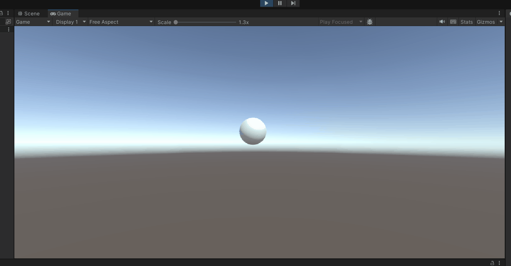

# 🧪 Transformaciones Básicas en Computación Visual

## 📅 Fecha
`2025-04-23` – Fecha de realización

---

## 🎯 Objetivo del Taller

En este taller se tiene como objetivo explorar los conceptos fundamentales de transformaciones geométricas (traslación, rotación y escala) en distintos entornos de programación, en este caso en el entorno de Unity.

---

## 🧠 Conceptos Aprendidos

Lista los principales conceptos aplicados:

- [x] Transformaciones geométricas (escala, rotación, traslación)

---

## 🔧 Herramientas y Entornos

Especifica los entornos usados:

- Unity (C#)


---

## 📁 Estructura del Proyecto

```
2025-04-23_taller0_transformaciones/
├── processing/           
├── python/                 # python, colab
├── threejs/            # react, threejs
├── unity/              # C#, unity
  ├── Scenes
    ├──SampleScene.unity      #Escena donde se encuentra la esfera
    ├──SampleScene.unity.meta
    ├──Scenes.meta        
  ├── Scripts
    ├──NewBehaviorScript.cs       # Script de la animación
    ├──NewBehaviourScript.cs.meta
    ├──Scripts.meta 
  .gitignore
  ├──DemostracionEsferaUnity.gif     #GIF
  ├──README.md    
```


---

## 🧪 Implementación

Explica el proceso:

### 🔹 Etapas realizadas
1. Crear proyecto en unity.
2. Crear escena y la esfera.
3. Crear el script el cual tiene la animación y cargarsela al objeto.
4. Correr el programa y grabar gif.

### 🔹 Código relevante

Incluye un fragmento que resuma el corazón del taller:

```c#
void Update()
    {
        // 1. Rotaci�n constante
        transform.Rotate(Vector3.forward, velocidadRotacion * Time.deltaTime);
        
        // 2. Traslaci�n aleatoria cada cierto tiempo
        if (Time.time - tiempoUltimaTraslacion > intervaloTraslacion)
        {
            CambiarDireccionTraslacion();
            tiempoUltimaTraslacion = Time.time;
        }
        transform.Translate(direccionTraslacion * velocidadTraslacion * Time.deltaTime);
        
        // 3. Escalado oscilante
        float factorEscala = 1f + Mathf.Sin(Time.time * velocidadOscilacionEscala) * rangoOscilacionEscala;
        transform.localScale = escalaBase * factorEscala;
    }
```

---

## 📊 Resultados Visuales

### 📌 GIF animado**:



---

## 🧩 Prompts Usados

Enumera los prompts utilizados:

```text
"Como crear un proyecto en unity"
"Como manejar un proyecto para crear una esfera y animarla en unity"
"Crea la animación de esfera con cambio constante cada ciertos segundos"
```

---

## 💬 Reflexión Final

Responde en 2-3 párrafos:

- ¿Qué aprendiste o reforzaste con este taller? A crear un proyecto en Unity
- ¿Qué parte fue más compleja o interesante? Crear la animación de la esfera, ya que no sabia como relacionar el script.
- ¿Qué mejorarías o qué aplicarías en futuros proyectos? Crear un video juego en unity.

---

## 👥 Contribuciones 

Describe exactamente lo que hiciste tú:

```markdown
- Cree el proyecto en unity
- Generé los GIFs y documentación
- Relacioné script al objeto de la esfera
- Integré el control generado por modelos de IA para la animación
```

---

## ✅ Checklist de Entrega

- [x] Carpeta `2025-04-23_taller0_transformaciones`
- [x] Código limpio y funcional
- [x] GIF incluido con nombre descriptivo (si el taller lo requiere)
- [x] Visualizaciones o métricas exportadas
- [x] README completo y claro
- [x] Commits descriptivos en inglés

---