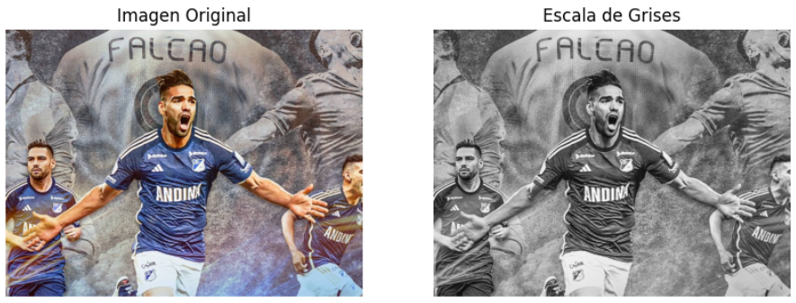
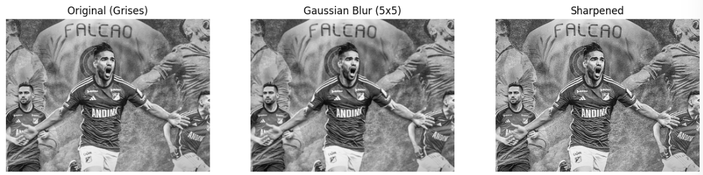
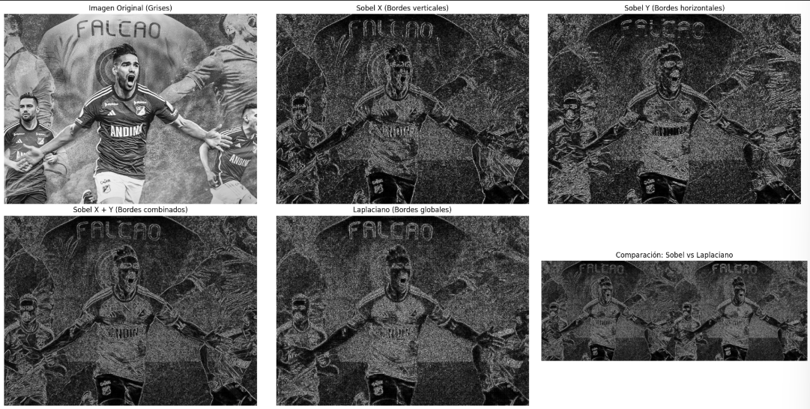

# 🧪 Taller - Ojos Digitales: Introducción a la Visión Artificial

## 📅 Fecha
`2025-05-02` – Fecha de realización

---

## 🎯 Objetivo del Taller

Visualizar como los filtros convolucionales se ven aplicados a una misma imagen, como el filtro Sobel y el filtro Laplaciano.

---

## 🧠 Conceptos Aprendidos

Lista los principales conceptos aplicados:

- [x] Filtros convolucionales
- [x] Kernel
- [x] Uso de cv2

---

## 🔧 Herramientas y Entornos

Entornos usados:

- Python (`cv2`, `matplotlib`.)
- Jupyter / Google Colab

---

## 📁 Estructura del Proyecto

```
2025-05-02_taller_ojos_digitales/
├── python/               # python/
colab/
├── README.md
```

---

## 🧪 Implementación

Explica el proceso:

### 🔹 Etapas realizadas
1. Buscar una imagen en google y descargarla.
2. Subir la imagen a colab.
3. Llamar la imagen dentro del colab y convertirla a escala de grises.
4. Aplicar filtros convolucionales y hacer comparativa.

### 🔹 Código relevante

Fragmento que resume el corazón del taller:

```python
# Segmentación semántica con DeepLab
# 1. Filtro de desenfoque (Gaussian Blur)
blurred_image = cv2.GaussianBlur(gray_image, (5, 5), 0)

# 2. Filtro de enfoque (Sharpening)
# Crear kernel de enfoque (sharpening)
sharpening_kernel = np.array([
    [0, -1, 0],
    [-1, 5, -1],
    [0, -1, 0]
])
```

---

## 📊 Resultados Visuales





## 🧩 Prompts Usados

Enumera los prompts utilizados:

```text
"Como leer una imagen con cv2"
"Como aplicar las convoluciones a esta imagen"
```

---

## 💬 Reflexión Final

Responde en 2-3 párrafos:

- ¿Qué aprendiste o reforzaste con este taller?
Aprendí a usar un poco cv2, reforze matplotlib
- ¿Qué parte fue más compleja o interesante?
El kernel
- ¿Qué mejorarías o qué aplicarías en futuros proyectos?
Ver todo el proceso de reconstrucción de la imagen.

---

Describe exactamente lo que hiciste tú:

```markdown
- Programé el kernel
- Generé documentación
- Integré la imagen bien en el colab porque tuve unos errores con cv2
```

---

## ✅ Checklist de Entrega

- [x] Carpeta `2025-05-02_taller_ojos_digitales`
- [x] Código limpio y funcional
- [x] Visualizaciones o métricas exportadas
- [x] README completo y claro
- [x] Commits descriptivos en inglés

---