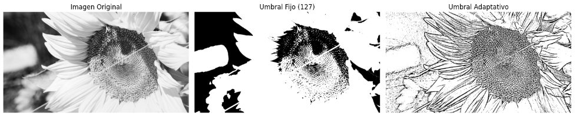
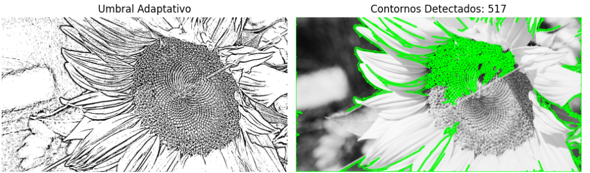
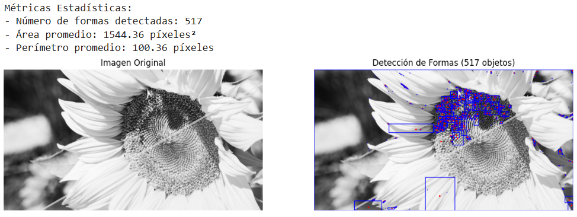
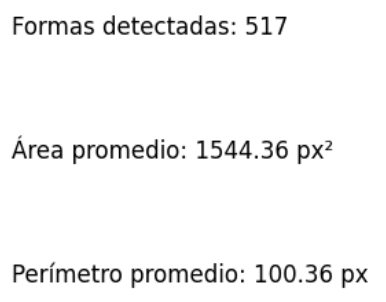

# 🧪 Segmentando el Mundo: Binarización y Reconocimiento de Formas

## 📅 Fecha
`2025-05-03` – Fecha de realización

---

## 🎯 Objetivo del Taller
El taller tiene como objetivo aplicar técnicas de segmentación en imágenes mediante umbralización, como umbral fijo y umbral adaptativo, además detectar contornos y visualizar centros de masa en la imágen.

---

## 🧠 Conceptos Aprendidos

Lista los principales conceptos aplicados:

- [x] Detección de contornos
- [x] Segmentación de imágenes

---

## 🔧 Herramientas y Entornos

Especifica los entornos usados:

- Python (`opencv-python`, `numpy`, `matplotlib`)
- Jupyter / Google Colab


---

## 📁 Estructura del Proyecto

```
2025-05-03_taller_segmentacion_formas/
├── entorno/               # python/, 
colab/
├── datos/                 # imágenes
 imágenes
├── resultados/            # capturas y métricas
├── README.md
```

---

## 🧪 Implementación

Proceso :

### 🔹 Etapas realizadas
1. Cargar imagén en escala de grises.
2. Aplicar umbralización fija y umbralización fija.
3. Detección y visualización de contornos.
4. Procesar contornos y visualizarlos en la imagén.
5. Mostrar métricas

### 🔹 Código relevante

Incluye un fragmento que resuma el corazón del taller:

```python
# Umbralización fija
_, fixed_thresh = cv2.threshold(gray_image, 127, 255, cv2.THRESH_BINARY)

# Umbralización adaptativa
adaptive_thresh = cv2.adaptiveThreshold(gray_image, 255,
                                       cv2.ADAPTIVE_THRESH_GAUSSIAN_C,
                                       cv2.THRESH_BINARY, 11, 2)
# Procesar cada contorno
for contour in contours:
    # Calcular momentos y centro de masa
    M = cv2.moments(contour)
    if M["m00"] != 0:
        cx = int(M["m10"] / M["m00"])
        cy = int(M["m01"] / M["m00"])
    else:
        cx, cy = 0, 0

    # Dibujar centro de masa
    cv2.circle(output_image, (cx, cy), 4, (0, 0, 255), -1)  # Punto rojo

    # Calcular y dibujar bounding box
    x, y, w, h = cv2.boundingRect(contour)
    cv2.rectangle(output_image, (x, y), (x+w, y+h), (255, 0, 0), 2)  # Rectángulo azul

    # Calcular métricas
    area = cv2.contourArea(contour)
    perimeter = cv2.arcLength(contour, True)
    areas.append(area)
    perimeters.append(perimeter)
```

---

## 📊 Resultados Visuales





---

## 🧩 Prompts Usados

Enumera los prompts utilizados:

```text
"Dime como aplicar umbralización fija y adaptativa a una imagén en python"
"Cómo detecto contornos en la imagén"
"Cómo proceso cada contorno y cálculo sus estadísticas"
```

---

## 💬 Reflexión Final

Responde en 2-3 párrafos:

- ¿Qué aprendiste o reforzaste con este taller?
La segmentación de imagénes y la detección de contornos y formas en las imágenes
- ¿Qué parte fue más compleja o interesante?
Me pareció muy interesante la forma de detectar formas
- ¿Qué mejorarías o qué aplicarías en futuros proyectos?
Aplicar a detección de estas formas por medio de una webcam
---

## 👥 Contribuciones Grupales (si aplica)

Describe exactamente lo que hiciste tú:

```markdown
- Programé los gráficos
- Generé documentación
- Cargué la imagén con cv2
- Implementé el código generado por módelos
```

---

## ✅ Checklist de Entrega

- [x] Carpeta `2025-05-03_taller_segmentacion_formas`
- [x] Código limpio y funcional
- [x] Visualizaciones de métricas exportadas
- [x] README completo y claro
- [x] Commits descriptivos en inglés

---