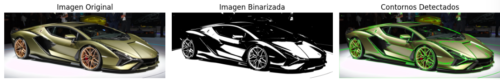
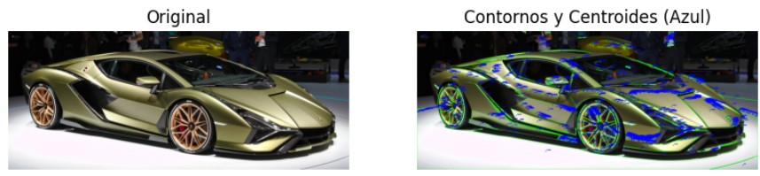
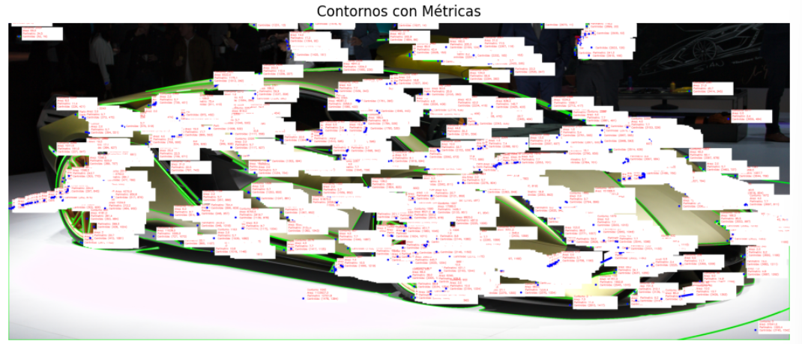

# 🧪 Análisis de Figuras Geométricas: Centroide, Área y Perímetro


## 📅 Fecha
`2025-05-06` – Fecha de realización

---

## 🎯 Objetivo del Taller
Detectar formas simplex en imágenes binarizadas y calcular sus propiedades.

---

## 🧠 Conceptos Aprendidos

Lista los principales conceptos aplicados:

- [ ] Detección y visualización de contornos en imágenes
- [ ] Conversión a imagen binarizadas

---

## 🔧 Herramientas y Entornos

Especifica los entornos usados:

- Python (`opencv-python`, `numpy`, `matplotlib`.)
- Google Colab
Link colab: https://colab.research.google.com/drive/1pYdc-8INPegcn9utKibaHVEWuGGqytDF?usp=sharing

---

## 📁 Estructura del Proyecto

```
2025-05-06_taller_analisis_figuras_geometricas/
├── python/               # python/
    ├──colab/
├── image-1.png/                 # imágenes 
├── image-2.png/                 # imágenes 
├── image.png/                 # imágenes 
├── DemostracionTallerAnalisisFiguras/                 # Gif 
├── README.md
```


---

## 🧪 Implementación

Explica el proceso:

### 🔹 Etapas realizadas
1. CArgar una imagen y binarizarla, además de detectar los contornos.
2. Dibujar los contornos sobre la imagen.
3. Calcular propiedades para cada contorno.
4. Dibujar cada contorno con sus métricas sobre la figura original.

### 🔹 Código relevante

Incluye un fragmento que resuma el corazón del taller:

```python
# 2. Binarización con threshold
_, thresh = cv2.threshold(gray, 127, 255, cv2.THRESH_BINARY)

# 3. Detección de contornos
contours, hierarchy = cv2.findContours(
    thresh,
    cv2.RETR_TREE,
    cv2.CHAIN_APPROX_SIMPLE
)

# 4. Dibujar contornos sobre la imagen original
img_contours = cv2.drawContours(img.copy(), contours, -1, (0, 255, 0), 2)

# Calcular y dibujar métricas para cada contorno
for i, contour in enumerate(contours):
    # Calcular propiedades
    area = cv2.contourArea(contour)
    perimeter = cv2.arcLength(contour, True)
    M = cv2.moments(contour)

    if M['m00'] != 0:
        cx = int(M['m10'] / M['m00'])
        cy = int(M['m01'] / M['m00'])
    else:
        cx, cy = 0, 0

```

---

## 📊 Resultados Visuales




### 📌 GIF animado sobre demostración en Colab:


---

## 🧩 Prompts Usados

Enumera los prompts utilizados:

```text
"Como funciona cv2.threshold()"
"Como funciona cv2.findContours()"
"Calcula la siguientes propiedades de los siguientes contornos"
"Dibuja sobre la imagen estos contornos"
```


---

## 💬 Reflexión Final

Responde en 2-3 párrafos:

- ¿Qué aprendiste o reforzaste con este taller? Como convertir una imagen a forma binarizada
- ¿Qué parte fue más compleja o interesante? Ver la cantidad de contornos de una imagen
- ¿Qué mejorarías o qué aplicarías en futuros proyectos? Aplicarlo a un proyecto por medio de una webcam

---

## 👥 Contribuciones Grupales (si aplica)

Describe exactamente lo que hiciste tú:

```markdown
- Aplique las funciones indicadas en la guía a partir de unas explicaciones de la documentación
- Generé documentación
- Integré código por parte de modelos de IA
```

---

## ✅ Checklist de Entrega

- [x] Carpeta `2025-05-06_taller_analisis_figuras_geometricas`
- [x] Código limpio y funcional
- [x] Visualizaciones de métricas por medio de tablas
- [x] README completo y claro
- [x] Commits descriptivos en inglés

---