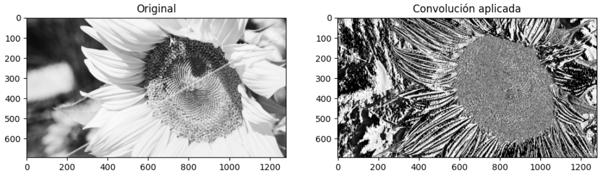
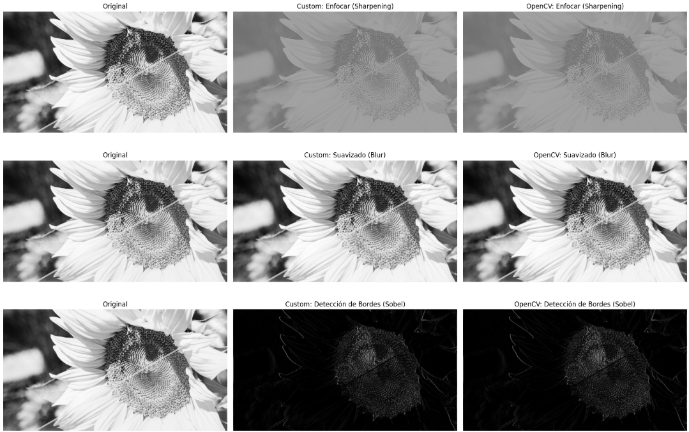

# 🧪 Filtro Visual: Convoluciones Personalizadas

## 📅 Fecha
`2025-05-07` – Fecha de realización

---

## 🎯 Objetivo del Taller
Diseñar e implementar filtros personalizados en imágenes para modificar bordes, difuminar o realzar detalles.

---

## 🧠 Conceptos Aprendidos

Lista los principales conceptos aplicados:

- [x] Convoluciones 2D
- [x] Kernels (blur y sharpening)
- [x] Detección de esquinas y bordes

---

## 🔧 Herramientas y Entornos

Especifica los entornos usados:

- Python (`opencv-python`, `numpy`, `matplotlib`)
- Google Colab
Link colab: https://colab.research.google.com/drive/1LGq85W5SPljVhBrgeC8vzCKbNsxSmcXy?usp=sharing

---

## 📁 Estructura del Proyecto

```
2025-05-07_taller_convoluciones_personalizadas/
├── python/               # python/ 
    ├──colab/
├── image-1.png/                 # imágenes
├── image.png/                 # imágenes
├── README.md
```

---

## 🧪 Implementación

Explica el proceso:

### 🔹 Etapas realizadas
1. Cargar una imagen.
2. Aplicación de la convolución 2D.
3. Definir kernels.
4. Comparación de resultados.

### 🔹 Código relevante

Incluye un fragmento que resuma el corazón del taller:

```python
# Función de convolución mejorada (manejo de bordes y tipos de datos)
def convolucion2d(imagen, kernel):
    """
    Versión mejorada con:
    - Manejo de tipos de datos float32
    - Padding de ceros (BORDER_CONSTANT)
    - Normalización automática
    """
    k_height, k_width = kernel.shape
    pad_height = k_height // 2
    pad_width = k_width // 2

    # Añadir padding de ceros
    padded = np.pad(imagen, ((pad_height, pad_height), (pad_width, pad_width)),
                   mode='constant')

    output = np.zeros_like(imagen)

    for i in range(imagen.shape[0]):
        for j in range(imagen.shape[1]):
            region = padded[i:i+k_height, j:j+k_width]
            output[i,j] = np.sum(region * kernel)

    return output

```

---

## 📊 Resultados Visuales




---

## 🧩 Prompts Usados

Enumera los prompts utilizados:

```text
"Como implemento una convolución 2D desde cero con numpy"
"Dame una función que aplique un kernel personalizado a cada pixel"
"Como hago un kernel que detecte esquinas o bordes"
```


---

## 💬 Reflexión Final

Responde en 2-3 párrafos:

- ¿Qué aprendiste o reforzaste con este taller? A implementar una convolución 2D
- ¿Qué parte fue más compleja o interesante? La función que aplique un kernel personalizado a cada pixel
- ¿Qué mejorarías o qué aplicarías en futuros proyectos? Usuaria el suavizado para mejorar las imágenes

---

## 👥 Contribuciones Grupales (si aplica)

Describe exactamente lo que hiciste tú:

```markdown
- Programé los kernels usados
- Generé documentación
- Integré código generado por modelos de IA
```

---

## ✅ Checklist de Entrega

- [x] Carpeta `YYYY-MM-DD_nombre_taller`
- [x] Código limpio y funcional
- [x] Visualizaciones o métricas exportadas
- [x] README completo y claro
- [x] Commits descriptivos en inglés

---